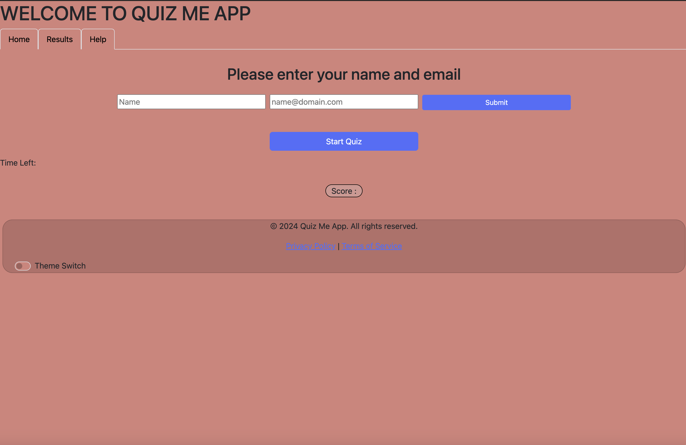

# React Portfolio

## Description

This project is a single-page portfolio application built using React.js. It showcases a web developer's portfolio, including sections for About Me, Portfolio, Contact, and Resume. Each section is dynamically rendered using `react-router-dom`. The portfolio also includes a header, navigation, and a footer that appears on every page, along with reusable components such as `Project`.

## Table of Contents

- [Installation](#installation)
- [Usage](#usage)
- [Features](#features)
- [Technologies](#technologies)
- [Screenshots](#screenshots)
- [License](#license)
- [Contact](#contact)

## Installation

To run this project locally, follow these steps:

1. Clone the repository:

   ```bash
   git clone https://github.com/your-username/react-portfolio.git
   ```

2. Navigate into the project directory:

   ```bash
   cd react-portfolio
   ```

3. Install dependencies using npm:

   ```bash
   npm install
   ```

4. Start the development server:
   ```bash
   npm run dev
   ```

This will start the application using Vite and allow you to view the portfolio at `http://localhost:3000`.

## Usage

Once the application is running, you will be presented with a simple navigation bar where you can view the following sections:

- **About Me**: Includes a photo/avatar and a short bio about the developer.
- **Portfolio**: Displays multiple projects with screenshots, descriptions, and links to live applications and GitHub repositories.
- **Contact**: Contains a contact form with fields for name, email, and message, along with validation for required fields.
- **Resume**: Provides a link to download the developer's resume and lists their proficiencies.

## Features

- **Reusable Components**: The `Project` component is used to display project information and is rendered multiple times for different projects in the Portfolio section.
- **React Router**: The application uses `react-router-dom` to switch between different sections of the portfolio without reloading the page.
- **Responsive Design**: The layout is responsive and adjusts for different screen sizes.
- **Dynamic Navigation**: The current section is highlighted in the navigation bar, and the URL changes when a navigation item is clicked.

## Technologies

- **React.js**: The main framework for building the user interface.
- **React Router DOM**: For handling navigation between different sections of the portfolio.
- **Vite**: For fast builds and development environment setup.
- **CSS**: For styling the components and layout of the portfolio.
- **JavaScript (ES6)**: Used for the logic and functionality of the application.

## Screenshots

Here is an example of one of the projects displayed in the portfolio:



## License

This project is licensed under the MIT License. See the `LICENSE` file for more details.

## Contact

For any inquiries or feedback, feel free to reach out:

- **Email**: your.email@example.com
- **LinkedIn**: [Your LinkedIn Profile](https://www.linkedin.com/in/your-profile)
- **GitHub**: [Your GitHub](https://github.com/your-username)
